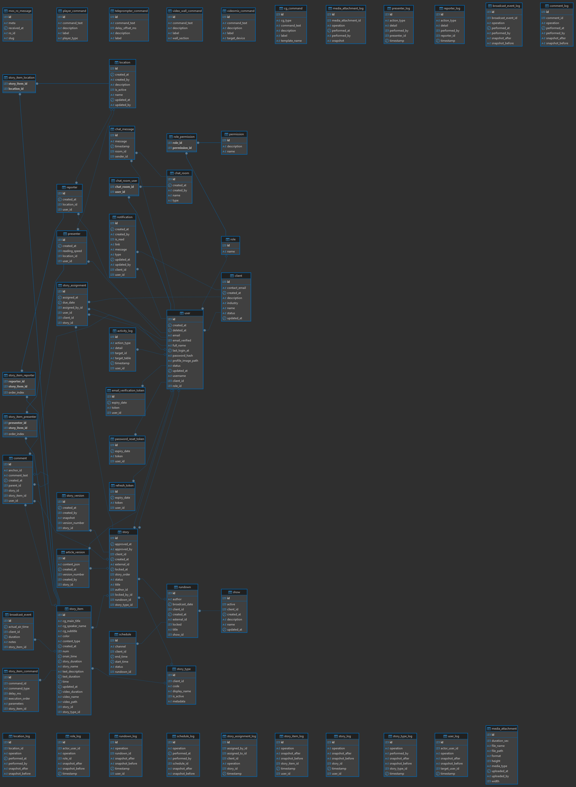
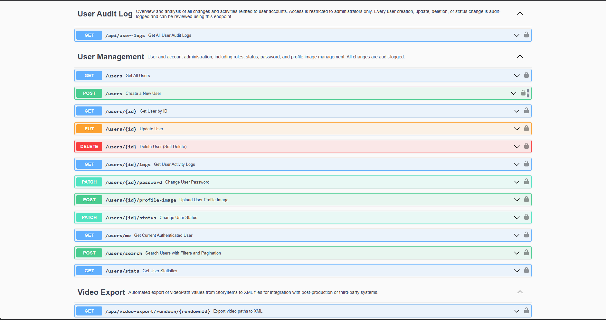
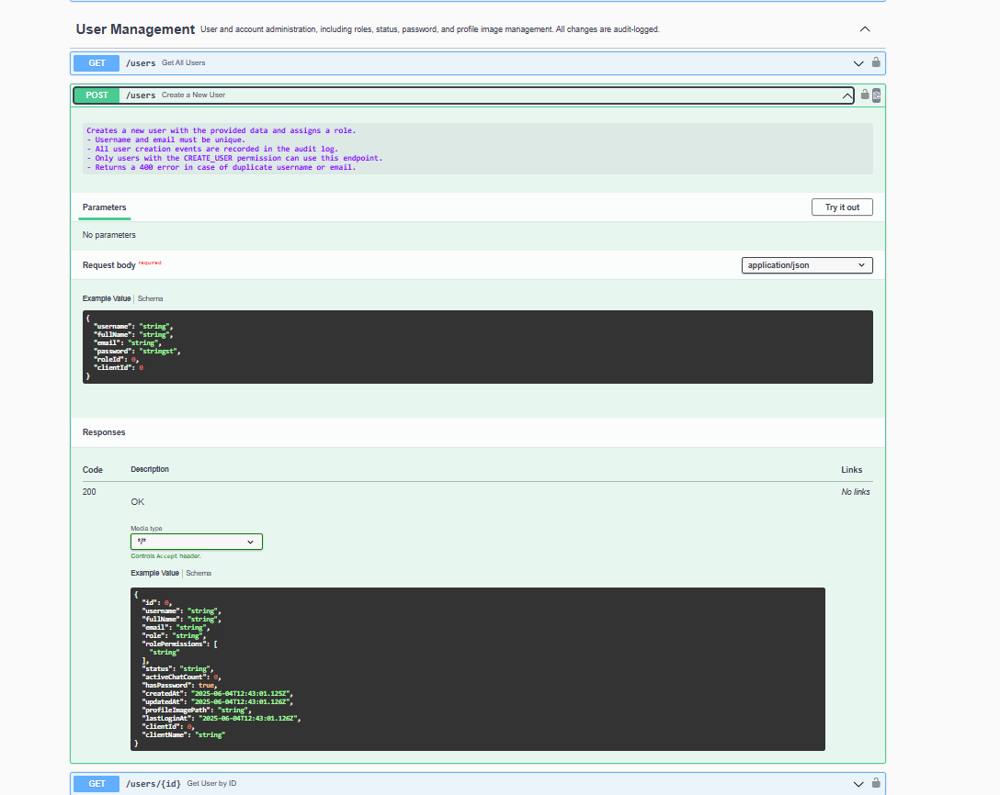
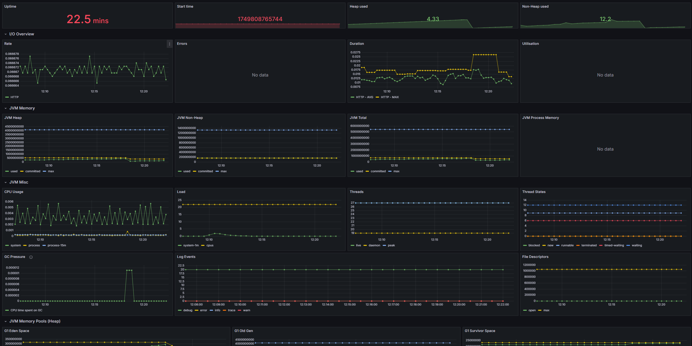

# spring-boot-backend-portfolio

This codebase is curated and maintained by Uros, a backend engineer specializing in enterprise Java/Spring Boot solutions. It demonstrates best practices in modern backend architecture, API design, and production-quality engineering.

This repository demonstrates an extensible, production-grade backend platform tailored for newsrooms, broadcast, and automation use cases. It showcases how to architect, document, and secure a modern Java backend following best enterprise practices.

## Business Impact Summary

Designed for television newsrooms, the platform centralizes story planning, device control, and content generation to reduce on‑air errors and accelerate production cycles. Integrated AI services help journalists craft titles, summaries, and social posts in seconds, while voice services automatically transcribe interviews and generate narration. Remote command modules streamline control of teleprompters, character generators, and video walls from one interface, cutting setup time during live shows. Built‑in analytics and dashboards provide managers with real‑time visibility into broadcast activity and resource usage. Secure APIs and SSL encryption ensure sensitive editorial data is protected end‑to‑end. The modular architecture makes it easier for IT teams to extend the system with new devices or workflows.


---

## About this Repository

This public portfolio showcases selected, production-grade code and design patterns from a complete newsroom and broadcast backend platform.
The repository is intended exclusively for code review and technical demonstration, and is **not** designed for direct deployment.

## Features

- 📊 **REST API** with Swagger/OpenAPI documentation — provides a clear contract for integrating newsroom apps and third‑party tools.
- 🔔 **Real-time WebSocket messaging** — enables live chat and presence updates so teams stay in sync during breaking news.
- 🔒 **Custom JWT authentication/authorization** — secures every request with signed tokens suitable for stateless scaling.
- 🛡️ **Role-based and permission-based access control** — grants fine-grained rights for journalists, editors, and admins.
- 🚀 **Modular, domain-driven design** — keeps the codebase organized for easier maintenance and future growth.
- 📁 **Advanced file & media storage management** — handles large media assets with consistent metadata and access rules.
- 🔌 **Integration:** MOS TCP server (Netty) and broadcast automation protocols — bridges newsroom software with studio devices.
- 🤖 **AI Chat & editorial tools** — Together AI generates titles, summaries, tags, CG fields, sentiment analysis, and social previews to speed content creation.
- 🗣️ **Voice-to-Text & Text-to-Voice services** — Lemonfox APIs transcribe interviews and produce narration, reducing manual work.
- 🎛️ **Remote studio device control** — REST endpoints for teleprompters, character generators, video walls, players, and mixers streamline on‑air operations.
- 📺 **TV stream previews & NDI multiviewers** — manage live video sources and custom layouts from one dashboard.
- 🔄 **RSS feed ingestion** — automatically pulls external news feeds into the system for fast story sourcing.
- 📊 **Dashboards and broadcast analytics** — provides daily and historical statistics for editorial planning.
- ✉️ **Email verification, password reset & notifications** — built‑in mail service keeps accounts secure and users informed.
- 📨 **Video, teleprompter, and signature exports** — generates XML, RTF, DOCX, or PDF files for downstream production tools.
- 🚦 **Redis caching & rate limiting** — protects APIs from spikes and keeps response times low.

## Technologies

- Java 21+
- Spring Boot, Spring Security, Spring Data JPA
- Netty (TCP server)
- STOMP/WebSocket
- MariaDB/MySQL
- Maven (build tool)  
  > *Docker support is available in the full, private repository.*
  > 
  > *The full codebase can be adapted for Gradle builds upon request.*

---

## Database ER Diagram

Below is a complete Entity-Relationship (ER) diagram of the core database schema  
(click to enlarge for details). Both the PNG and PDF versions contain all tables and relationships.



> **Download the [full PDF with all tables and relationships](docs/nms_core_schema.pdf) for detailed, high-resolution viewing.**


## Database Schema Auto-Update

For demo and portfolio purposes, this project is configured with:

    spring.jpa.hibernate.ddl-auto=update

This setting demonstrates how automatic database schema updates could be configured in a runnable application, allowing reviewers to understand the approach without manual migration steps.

> ⚠️ **Production Usage Warning**  
>
> - In any real production environment, database schema management **must** be handled via migration tools such as [Flyway](https://flywaydb.org/) or [Liquibase](https://www.liquibase.org/).
> - The `ddl-auto` property should be set to `validate` (or `none`) to prevent accidental schema changes.
> - All credentials and secrets **must** be provided via secure mechanisms and **never committed to version control**.
>
> This configuration is **intentional**, to simplify code review and illustrate project architecture for demo purposes only.  
> **This public repository does not contain a complete, runnable application, and this configuration is provided for demonstration only.**  
> **Do not use this configuration in production.**
>
> _In the full production implementation, all database migrations are version-controlled, all secrets are managed securely, and schema changes are never performed automatically._

## Deployment Overview

1. **Build and run with Docker Compose**
   ```bash
   docker-compose up --build
   ```
   This launches all services with sensible defaults for demonstration.
2. **Components started**
   | Service | Purpose |
   |---------|--------|
   | `nms-server` | Spring Boot backend serving APIs and WebSockets |
   | `mariadb` | Stores newsroom data such as stories, rundowns, and logs |
   | `redis` | Caches sessions and enforces rate limits for fast responses |
   | `prometheus` | Collects runtime metrics from the server |
   | `grafana` | Displays dashboards built from Prometheus metrics |

---

## Quick Start (Local Review Build)

This section explains how to run the **review/demo build** provided in the `nms-server-deploy-full.tar.gz` archive.  
It is intended for internal review and demonstration purposes only.

### 1. Extract the archive

```bash
tar -xvzf nms-server-deploy-full.tar.gz
cd nms-server-deploy
```

After extraction, the directory structure should look like:

```text
.env
.env.example
docker-compose.yml
Dockerfile
nms-server-demo-deploy-1.0.0-SNAPSHOT.jar
monitoring/
  prometheus.yml
```

### 2. Build and start containers

```bash
docker build -t nms-server:latest .
docker-compose up -d
```

### 3. Services and ports

| Service        | URL                                          | Description                           |
|----------------|----------------------------------------------|---------------------------------------|
| API & Swagger  | https://localhost:8443/api/swagger-ui/index.html | REST API documentation               |
| Grafana        | http://localhost:3000                        | Dashboards (admin/admin)              |
| Prometheus     | http://localhost:9090                        | System metrics                        |
| MariaDB        | localhost:3307                               | Database (root/root)                  |
| Redis          | localhost:6379                               | Caching and rate limiting             |

### 4. Notes

- The `uploads_data` volume persists uploaded files across container restarts.  
- `.env` contains all environment variables — adjust as needed before starting.  
- For production deployments, change `JWT_SECRET`, database credentials, and all `change_me` values.  

## Security & Access Control

- **JWT authentication with refresh tokens** secures API calls while allowing stateless scaling.
- **Role and permission system** restricts sensitive actions such as device control to authorized staff.
- **Email verification and password reset flows** ensure only verified users gain access.
- **SSL/TLS over HTTPS** encrypts all traffic end-to-end; a demo keystore is provided.
- **Configurable CORS and rate limiting** protect the API from cross-site abuse and request floods.


---

## ⚠️ Portfolio Notice

**This repository contains only a subset of the codebase, published for portfolio and code review purposes.**  
It is not a complete, runnable application and is not intended for deployment.

- Only key modules, representative controllers, entities, DTOs, and configuration are included.
- Full business logic, all features, and proprietary integrations remain private.
- **Build and run instructions are intentionally omitted** — the project is not meant to be built or executed in this form.

---

## Private Full Project Access

For qualified clients, technical partners, or enterprise code review,  
**full access to the complete codebase is available privately** upon request and under NDA (Non-Disclosure Agreement).

This includes:
- Complete business logic, proprietary integrations, and production configuration
- All entities, repositories, and extensible project structure
- Docker and cloud deployment support (custom CI/CD and deployment scripts available on request)
- Extended technical documentation

To request a private review or to discuss partnership, please contact me directly via [LinkedIn](https://www.linkedin.com/in/uros-ilic-6a201436a/).

---

## API Documentation

All endpoints are fully documented using Swagger/OpenAPI.  
Below are example screenshots from the live Swagger UI:

**User Management endpoints overview:**



**Create User endpoint detail:**



---


## Example API Usage

### User Authentication (Login)
```http
POST /api/auth/login
Content-Type: application/json

{
  "username": "admin",
  "password": "admin123"
}

```

```json
{
  "accessToken": "...",
  "refreshToken": "...",
  "tokenType": "Bearer",
  "username": "admin",
  "fullName": "Admin",
  "role": "ADMIN",
  "user_id": 6
}
```

### Create New User

```http
POST /api/users
Authorization: Bearer <token>
Content-Type: application/json

{
  "username": "johndoe",
  "fullName": "John Doe",
  "email": "john@example.com",
  "password": "SuperSecret123",
  "roleId": 2,
  "clientId": 1
}

```

## Highlighted Modules & Utilities

This codebase is not just a CRUD backend, but demonstrates advanced, reusable modules relevant for modern newsroom and broadcast operations.
Key examples include:

WordGeneratorUtil — robust DOCX export for stories, scripts, and editorial content (Apache POI based). Supports granular export of news items, comments, and metadata for newsroom workflows.

PdfGeneratorUtil — automated PDF generation for rundowns and editorial plans (PDFBox integration), optimized for structured, multi-level content.

GlobalExceptionHandler — uniform, production-grade exception mapping across all REST endpoints.

JwtAuthenticationFilter — custom JWT security filter for stateless, scalable authentication.

WebSocket Messaging System — real-time presence, chat, and newsroom event broadcasting using STOMP/WebSocket with user tracking.

## Project Structure

```text

src/
  main/
    java/
      rs/
        nms/
          newsroom/
            server/
              config/
              controller/
              domain/
              dto/
              exception/
              mos/
              service/
              tcp/
              util/
              websocket/
    resources/
      application.yml
  test/
    java/
      rs/
        nms/
          newsroom/
            server/
              // Unit and integration test classes
docs/
pom.xml
.gitignore
README.md
LICENSE

```
## Testing

Representative unit and integration tests (JUnit 5, Spring Boot Test) are provided in `src/test/java/`.  
These cover the main services and business logic relevant for newsroom automation and backend best practices.

## Monitoring & Observability

Prometheus and Grafana provide full visibility into the system:

- **Prometheus** scrapes metrics exposed by Spring Boot Actuator, capturing HTTP request counts/latency, database usage, WebSocket traffic, and JVM health.
- **Grafana dashboards** visualize memory consumption, CPU load, thread states, and custom newsroom metrics so operations teams can spot issues quickly.

Sample Grafana dashboard (JVM/Micrometer):

[](http://localhost:3000/d/517290dc-ae1b-4c72-9ea6-d9c70f44f6ca/jvm-micrometer?orgId=1&from=now-24h&to=now&refresh=30s)

> **Note:**
> Some panels display "No data" as this screenshot is from a development environment with limited workloads and integrations enabled.
> Full observability, alerting, and production monitoring scripts (including advanced metrics and alerting) are available in the private repository and upon request for qualified clients.
> **Business-oriented dashboards** (with high-level system and workflow health metrics for managers and end-users) can be provided or customized for client needs.

## Portfolio & Contact

For technical consultation, code review, or backend contract work,  
contact via [LinkedIn](https://www.linkedin.com/in/uros-ilic-6a201436a/).

## License

This project is licensed under the MIT License. See the [LICENSE](./LICENSE) file for details.

## Contribution

This repository serves as a curated professional portfolio.  
External contributions are not accepted, but code review or technical discussion is welcomed upon request.
